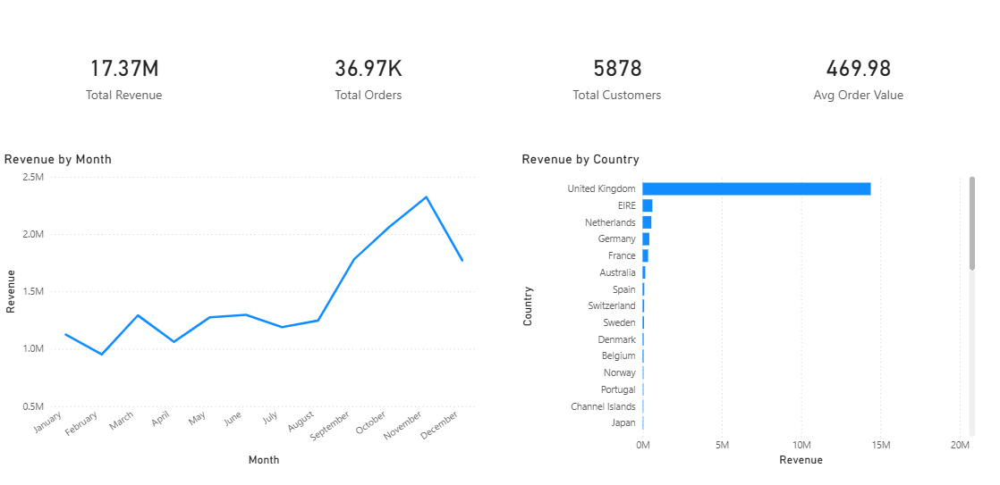
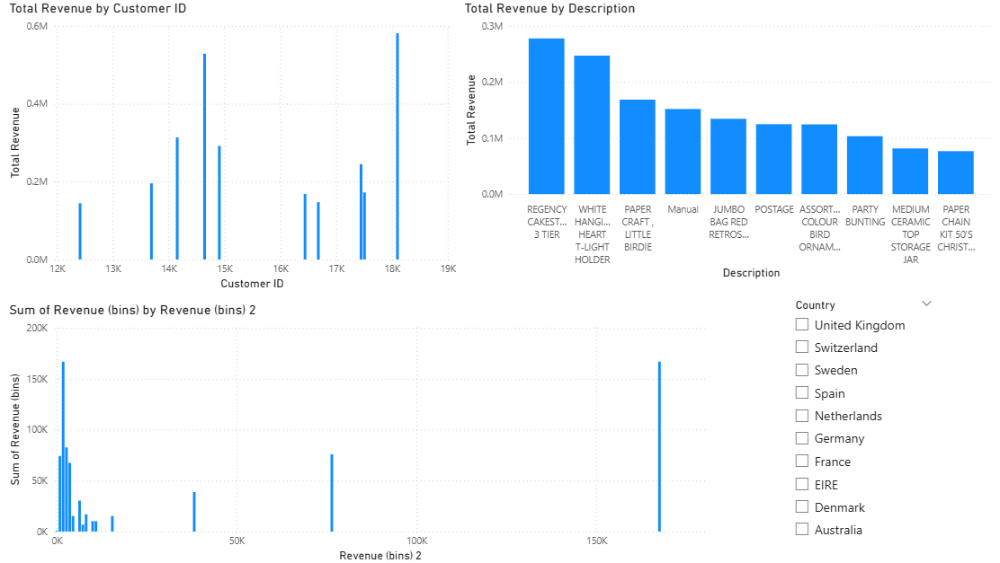

# 📊 E-Commerce Analytics & Revenue Prediction Project

## 📌 Project Overview
This project analyzes an e-commerce retail dataset to uncover revenue trends, customer purchasing behavior, and product performance. A machine learning model was built to predict customer total spending.

---

## 🛠 Tools Used
- Python (Pandas, Matplotlib, Scikit-learn)
- SQL
- Power BI
- Excel
- Git & GitHub

---

## 🧹 Data Cleaning
- Removed null CustomerIDs
- Filtered negative quantities and prices
- Removed duplicates
- Created Revenue feature
- Engineered time-based features (Year, Month, Day)

Final dataset size: 779,425 rows

---

## 📊 Key Insights

- Revenue spikes between September–November (seasonal effect)
- UK dominates overall revenue
- Top 10 customers contribute 16% of total revenue
- Top 10 products contribute 8.57% of total revenue

---

## 🤖 Machine Learning Model

**Model Used:** Random Forest Regressor  
**Target:** Total Customer Spending  

**Performance:**
- R² Score: 0.94
- MAE: 787

Key predictive feature: TotalQuantity

---

## 📈 Dashboard Preview

### Executive Overview


### Customer Insights


---

## 🚀 Business Recommendations

- Launch targeted campaigns before peak season (Sept–Nov)
- Reduce geographic revenue dependency by expanding beyond UK
- Implement loyalty program for high-value customers
- Optimize inventory based on top-performing products

---

## 📂 Project Structure
```
ecommerce-analytics-ml/
├── data/
├── notebooks/
├── sql/
├── src/
├── dashboard/
├── presentation/
└── README.md
```

---

## 👨‍💻 Author
Deepak Suryavanshi